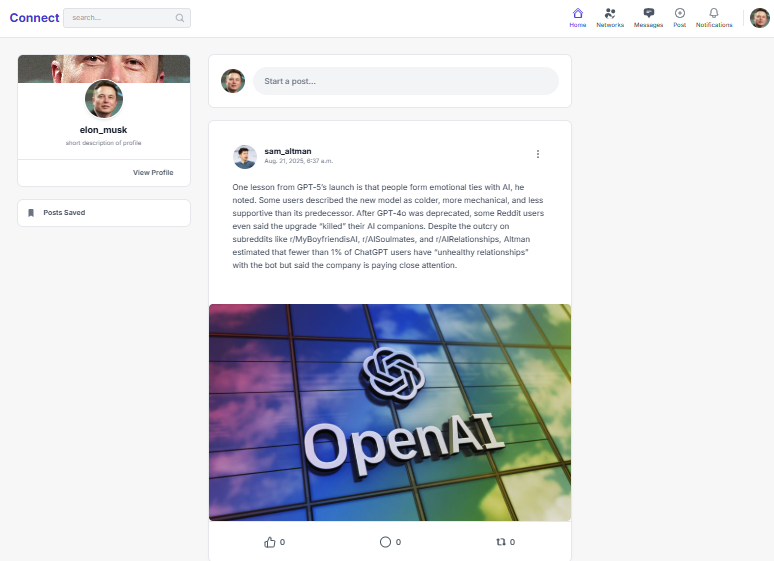

# Social Media Application Project README

<br>
<div align="center">
  
</div>
<br>

## About The Project
This project is a comprehensive and dynamic social media application developed using the powerful Django framework and the Python programming language. The goal of this project is to provide a complete platform for users to connect, share content, and interact with one another. With its meticulous design and advanced algorithms, the application offers a smooth and intelligent user experience.

## Key Features

### Account Management:
- User account creation with an email verification system.
- Ability to update profile information and change passwords.
- Login attempt management using django-axes to prevent brute-force attacks.

### Connections System:
- Users can send friend requests, which must be accepted by the recipient.

### Content (Posts):
- Create, edit, and delete text-based posts.
- Interact with posts by liking, commenting, and sharing.
- Ability to save posts for easy future access.

### Smart Recommendation Systems:
- **Network Recommendation:** An ORM-based algorithm prioritizes friends of your existing friends for connection suggestions.
- **Post Recommendation:** The algorithm prioritizes showing posts from your friends or posts with high engagement (likes, comments, shares) on the main feed.

### Advanced Search:
- Utilizes ORM and the watson_search package for fast and accurate searching of users and posts. and notification

### Comment Management:
- A content filtering algorithm checks comments for offensive language before they are published and blocks them with an error message if inappropriate content is detected.

### Notifications System:
- An asynchronous notification system alerts users about interactions (likes, comments, shares) and new posts from their friends.

## Technologies Used
- **Backend:** Python, Django  
- **Containerization:** Docker  
- **Web Server:** Nginx, Gunicorn  
- **Database:** MySQL  
- **Caching & Queue:** Redis, Celery  
- **Search Engine:** watson_search  
- **Security:** django-axes  

## How to Install and Run

### Configure the Environment File (.env)
Create a `.env` file from `.env.example` and set the following values:

```env
# SECRET KEY for the Django project
SECRET_KEY=your_secret_key_here

# MySQL database information
DB_PASSWORD=your_db_password_here

# Email information for sending the verification link
EMAIL_HOST_USER=your-email@gmail.com
EMAIL_HOST_PASSWORD=your_password_or_app_password
```

⚠️ **Important Note:** It is highly recommended to use an App Password for your email to enhance security.

### Run the Project
Execute the following commands in your terminal from the project's root directory:

```bash
# Build the Docker images
docker-compose build

# Run the containers in detached mode
docker-compose up -d
```

After running the commands, the application will be accessible at [http://localhost:8080](http://localhost:8080).

### Admin Panel Access
You can log in to the Django admin panel with the following default credentials:

```
username: admin
password: admin123
```

## Development Team
- **Esmatullah Hadel**

## Contact Information
- **Email:** hadelesmatullah@gmail.com  
- **LinkedIn:** [Esmatullah Hadel](https://www.linkedin.com/in/esmatullah-hadel-682161279)  
- **GitHub:** [social-media-app](https://github.com/Esmat434/social-media-app)  

## Future Plans
- **Messaging System:** A real-time chat and messaging feature is currently under development and will be added to the project soon.
